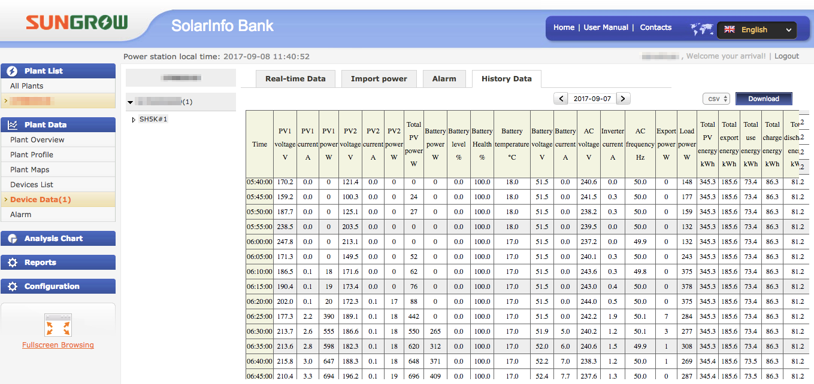
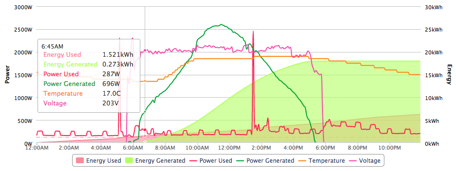

# Herculis

Use AWS Lambda to fetch your Sungrow Solar metrics and send these to the PVOutput website.

Herculis downloads the Sungrow metrics from:



And uploads the relevant data to the PVOutput.org site:



## Prequisites

An [AWS account](https://aws.amazon.com). Herculis is an AWS Lamdba function. 
If this will be your only Lambda function, you will remain within the 
[AWS Free Tier](https://aws.amazon.com/lambda/pricing/). There will be nominal 
charges (a few cents per month) for Amazon S3 and data transfers.

To deploy the AWS Lamdba function, the [Serverless](https://serverless.com/framework/docs/providers/aws/guide/installation/) framework is used.

## Installation

1.Download or clone this repository to your local workstation.

### Serverless Framework

2. To ease the setup and configuration of this Lamdba, Serverless is used to 
deploy the code and it's dependancies.

On your local workstation, install [serverless](https://serverless.com/framework/docs/providers/aws/guide/installation/).

```
npm install serverless
```

3. Setup your AWS Profile as per [Serverless guidelines](https://serverless.com/framework/docs/providers/aws/guide/credentials/).

4. Edit serverless.yml and update the following API credentials.

For PVOutput, you can find these under Settings.

For Sungrow Solarinfo Bank, you will need to traverse the website to discover
your Device ID, User ID and Plant ID. Start at 
http://www.solarinfobank.com/user/allplants and click on your Plant Name and 
then click edit. Each time noting the URL parameters called.

```
pvo_key: XXXXXXXX
pvo_systemid: XXXXXXXX
sgDeviceId: XXXXXXXX
sgPlantId: XXXXXXXX
sgUserId: XXXXXXXX
```

### AWS setup

5. In AWS, switch to the respective AWS region (as defined in your 
serverless.yml file). 

Navigate to EC2 services and under Systems Manager Shared Resources, create a 
Parameter Store parameter named "sungrow_time" and set the value to "nil".

### Deployment

6. Deploy Herculis:

On your local workstation, deploy Herculis:

```
serverless deploy 
```

7. Now browse to your PVOutput.org system.

## Acknowledgements

The python interface to PV Output API was forked from [sungrow2pvoutput](https://github.com/kronicd/sungrow2pvoutput).
